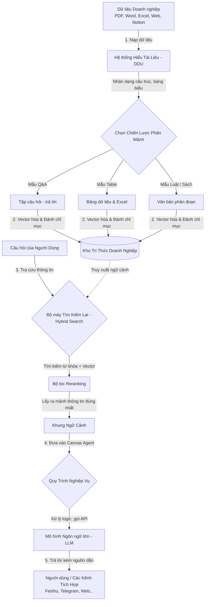

# RAGFlow - Nền Tảng Trích Xuất Tri Thức & Tự Động Hóa Quy Trình Bằng AI

Chào mừng bạn đến với **RAGFlow**, một động cơ RAG (Retrieval-Augmented Generation) và Nền tảng Agentic thế hệ mới. Khác với các hệ thống AI thông thường dễ gặp hiện tượng "ảo tưởng" (hallucination) hoặc khó xử lý các định dạng tài liệu phức tạp, RAGFlow được thiết kế để trở thành **cầu nối tri thức chuẩn xác** cho mọi doanh nghiệp.

Tài liệu này tập trung giải thích **nghiệp vụ hệ thống** — RAGFlow giải quyết bài toán gì, hoạt động ra sao và mang lại giá trị nào cho vận hành doanh nghiệp.

---

## 🎯 Giá Trị Nghiệp Vụ Cốt Lõi (Business Value)

Trong môi trường doanh nghiệp, dữ liệu tồn tại ở khắp nơi: hợp đồng PDF, báo cáo tài chính Excel, tài liệu kỹ thuật Word, hay ảnh chụp biên lai từ máy quét. Việc đưa những dữ liệu này vào các mô hình ngôn ngữ lớn (LLM) thường gặp các rào cản lớn:
1. **Dữ liệu phi cấu trúc phức tạp**: PDF scan, bảng biểu lồng nhau hoặc sơ đồ trong tài liệu rất khó đọc chính xác.
2. **Hiện tượng ảo tưởng (Hallucination)**: LLM tự bịa ra thông tin nếu không có ngữ cảnh chính xác và đáng tin cậy.
3. **Thiếu tính kiểm chứng (Traceability)**: Người dùng không biết câu trả lời của AI lấy từ trang nào, dòng nào của tài liệu gốc.
4. **Quy trình nghiệp vụ tĩnh**: Không thể tích hợp các bước ra quyết định tự động (phân loại câu hỏi, gọi API đối tác, duyệt điều kiện).

**RAGFlow giải quyết triệt để các vấn đề trên thông qua sự kết hợp giữa Hiểu tài liệu chuyên sâu (Deep Document Understanding) và Quy trình Agentic trực quan (Canvas).**

---

## 🔄 Luồng Nghiệp Vụ Tổng Quan (Core Business Workflow)

Dưới đây là hành trình của dữ liệu từ khi được doanh nghiệp tải lên cho đến khi trở thành câu trả lời đáng tin cậy cho khách hàng hoặc nhân viên:

---

## 🏛️ 5 Trụ Cột Nghiệp Vụ Chính (Core Pillars)

### 1. Hiểu Tài Liệu Chuyên Sâu (Deep Document Understanding - DDU)
Hệ thống sử dụng các mô hình AI thị giác và OCR để nhận diện tài liệu theo bố cục:
* **Nhận diện Bảng biểu**: Tự động nhận diện cấu trúc hàng/cột của các bảng biểu phức tạp trong tài liệu tài chính, giữ nguyên mối quan hệ dữ liệu thay vì đọc text tràn lan.
* **Xử lý tài liệu quét (Scan OCR)**: Đọc các văn bản chụp, PDF scan với độ chính xác cao.
* **Trích xuất thông tin phi văn bản**: Đọc hiểu hình ảnh, biểu đồ nằm trong tài liệu để đưa vào cơ sở dữ liệu tri thức.

### 2. Chiến Lược Phân Mảnh Dựa Trên Mẫu (Template-based Chunking)
Mỗi loại tài liệu có cấu trúc nghiệp vụ riêng. RAGFlow cung cấp các khuôn mẫu phân mảnh (chunking templates) chuyên biệt để tối ưu hóa khả năng tìm kiếm:
* **Q&A**: Tự động chuyển đổi tài liệu hướng dẫn thành các cặp Câu hỏi - Câu trả lời.
* **Resume (Hồ sơ ứng viên)**: Nhận diện và phân loại thông tin ứng viên (Kinh nghiệm, học vấn, kỹ năng).
* **Law (Văn bản pháp luật)**: Tách tài liệu theo các Điều khoản, Khoản, Điểm để tra cứu điều luật chính xác.
* **Table (Bảng biểu/Excel)**: Phân mảnh bảo toàn cấu trúc dữ liệu dòng-cột để phục vụ tính toán.
* **Paper / Book (Sách & Nghiên cứu)**: Phân đoạn theo tiêu đề chương mục, tóm tắt và tài liệu tham khảo.

### 3. Bộ Máy Truy Xuất Chính Xác & Giảm Hallucination
* **Tìm kiếm Lai (Hybrid Retrieval)**: Kết hợp giữa tìm kiếm ngữ nghĩa (Vector Search) và tìm kiếm từ khóa truyền thống (Full-text Search) để không bỏ sót bất kỳ từ khóa chuyên ngành nào.
* **Tái xếp hạng (Reranking)**: Đánh giá lại độ liên quan của các mảnh thông tin trước khi gửi cho LLM, chỉ chọn lọc những thông tin có độ tin cậy cao nhất.
* **Trích dẫn minh bạch (Grounded Citations)**: Câu trả lời của chatbot luôn đính kèm link/vị trí chính xác của tài liệu nguồn. Người dùng có thể click để xem trực tiếp trang tài liệu chứa thông tin đó nhằm đối chiếu.

### 4. Thiết Kế Quy Trình Tự Động Trực Quan (Agentic Workflow Canvas)
Doanh nghiệp không chỉ cần hỏi-đáp đơn thuần, mà cần tự động hóa các bước xử lý. Canvas kéo thả của RAGFlow cung cấp các "nút nghiệp vụ" mạnh mẽ:
* **Begin**: Điểm bắt đầu nhận yêu cầu khách hàng.
* **Categorize**: Phân loại ý định khách hàng (Ví dụ: Hỏi giá -> Chuyển hướng sang kho dữ liệu bán hàng; Báo lỗi sản phẩm -> Chuyển sang quy trình hỗ trợ kỹ thuật).
* **LLM**: Trí tuệ nhân tạo xử lý ngôn ngữ, tóm tắt, viết thư, dịch thuật.
* **Retrieval**: Nút tra cứu thông tin từ các kho tri thức đã thiết lập.
* **Invoke (Gọi API ngoài)**: Kết nối với các hệ thống ERP, CRM hiện có của doanh nghiệp để lấy trạng thái đơn hàng, thông tin khách hàng thời gian thực.
* **Excel Processor**: Đọc và tính toán trên các file bảng biểu động do người dùng tải lên trong lúc chat.
* **Switch**: Rẽ nhánh luồng xử lý tùy thuộc vào điều kiện (Ví dụ: Nếu khách hàng VIP -> Ưu tiên xử lý nhanh).

### 5. Kết Nối Đa Kênh Tác Vụ (Multi-channel Integration)
Hệ thống hỗ trợ cấu hình và xuất bản Chatbot đến nhiều kênh giao tiếp doanh nghiệp và khách hàng sử dụng hàng ngày:
* Kênh chat nội bộ: **Feishu / Lark**, **Discord**.
* Kênh chat khách hàng: **Telegram**, **Line**.
* Cung cấp **Bộ SDK (Python/JS)** và các **API mở** để doanh nghiệp tích hợp trực tiếp khung chat vào website của mình.

---

## 💼 Kịch Bản Ứng Dụng Thực Tế (Business Use Cases)

| Lĩnh vực | Bài toán nghiệp vụ giải quyết | Vai trò của RAGFlow |
| :--- | :--- | :--- |
| **Hỗ trợ Khách hàng (Customer Service)** | Giảm tải cho tổng đài, trả lời khách hàng 24/7 với thông tin chính xác về chính sách, giá cả. | Sử dụng mẫu **Q&A** nạp hướng dẫn sử dụng sản phẩm. Dùng nút **Categorize** để lọc các câu hỏi cần chuyển cho nhân viên hỗ trợ thực tế. |
| **Pháp chế & Kiểm soát nội bộ** | Tra cứu hàng ngàn trang điều luật, hợp đồng kinh tế cũ để đối chiếu rủi ro pháp lý. | Sử dụng mẫu **Law** nạp luật doanh nghiệp và quy chế nội bộ. Chatbot trả lời kèm theo điều khoản cụ thể làm căn cứ. |
| **Quản trị Nhân sự (HR)** | Giải đáp nhanh các quy định nghỉ phép, phúc lợi, bảo hiểm; sàng lọc CV ứng viên. | Sử dụng mẫu **Resume** để đọc thông tin ứng viên. Thiết kế Agent trả lời câu hỏi quy chế nội bộ tự động. |
| **Y tế & Nghiên cứu kỹ thuật** | Tìm kiếm phác đồ điều trị, tài liệu hướng dẫn vận hành máy móc công nghiệp nặng. | Sử dụng mẫu **Paper** và **Deep Document Understanding** để đọc bản vẽ kỹ thuật, bảng thông số máy móc nhằm hỗ trợ kỹ sư hiện trường. |

---

## 📈 Tầm Nhìn Phát Triển Nghiệp Vụ (Roadmap)
* **Mở rộng kết nối nguồn dữ liệu**: Đồng bộ hóa tự động từ các nguồn đám mây lớn (Confluence, Notion, Google Drive, AWS S3).
* **Bộ nhớ thông minh (Agent Memory)**: Giúp các Agent ghi nhớ ngữ cảnh cá nhân của từng khách hàng qua nhiều phiên làm việc khác nhau.
* **Đa chế độ (Multimodal)**: Đọc hiểu và phân tích sâu các hình ảnh, sơ đồ kỹ thuật trực tiếp trong các file PDF/DOCX.
* **Chạy Code An Toàn (Code Sandbox)**: Cho phép các Agent tự viết mã và chạy thử nghiệm tính toán số liệu phức tạp ngay trong phiên làm việc.
