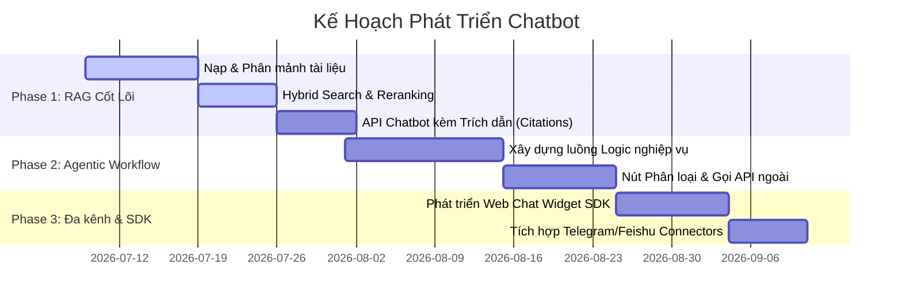

# Kế Hoạch Triển Khai Mora Chatbot (Dựa trên Chiến Lược RAGFlow)

Tài liệu này vạch ra kế hoạch chi tiết để xây dựng và phát triển hệ thống **Mora Chatbot** thế hệ mới. Kế hoạch này kế thừa triết lý từ hệ thống RAGFlow, tập trung giải quyết triệt để vấn đề ảo tưởng (hallucination) của AI bằng phương pháp trích xuất tri thức chuẩn xác và tự động hóa quy trình nghiệp vụ (Agentic Workflow).

---

## 🎯 1. Mục Tiêu & Giá Trị Nghiệp Vụ Của Chatbot

* **Độ chính xác tuyệt đối:** Không trả lời bừa bãi, mọi câu trả lời của Chatbot phải dựa trên cơ sở dữ liệu tri thức được phê duyệt (Grounding).
* **Trích nguồn minh bạch (Grounded Citations):** Cho phép người dùng kiểm chứng nguồn thông tin bằng cách đính kèm nguồn dẫn cụ thể (tên tài liệu, trang, dòng).
* **Khả năng tự động hóa (Agentic):** Chatbot không chỉ trả lời tĩnh mà có thể phân loại câu hỏi, gọi API để lấy thông tin thời gian thực, hoặc chuyển hướng thông minh.
* **Đa kênh tiếp cận:** Dễ dàng tích hợp vào Website doanh nghiệp và các nền tảng chat phổ biến.

---

## 🏛️ 2. Các Trụ Cột Kỹ Thuật Tập Trung Cho Chatbot

### A. Hệ Thống Nạp & Phân Mảnh Tài Liệu Tri Thức
Để Chatbot trả lời đúng, dữ liệu đưa vào kho tri thức cần được cấu trúc hóa tối ưu:
1. **Trích xuất tài liệu nâng cao (DDU):** Hỗ trợ đọc hiểu PDF (kể cả bản quét OCR), Word, Excel và nhận diện chính xác các bảng biểu lồng nhau.
2. **Chiến lược phân mảnh (Chunking Templates):**
   * **Template Q&A:** Dành cho các bộ tài liệu Hỏi - Đáp nhanh, hướng dẫn xử lý sự cố.
   * **Template Law (Điều khoản):** Chia nhỏ văn bản theo Điều, Khoản, Điểm giúp Chatbot trích dẫn chính xác luật định.
   * **Template Table (Bảng biểu):** Giữ nguyên cấu trúc hàng/cột của Excel/CSV phục vụ cho việc tính toán.
   * **Template Book/Paper:** Chia đoạn theo cấu trúc logic chương mục để tóm tắt tốt nhất.

### B. Bộ Máy Tìm Kiếm & Truy Xuất Tri Thức (Retrieval Engine)
Quyết định chất lượng thông tin cung cấp cho mô hình ngôn ngữ lớn (LLM):
1. **Tìm kiếm Lai (Hybrid Search):** 
   * Kết hợp **Vector Search** (truy tìm ngữ nghĩa) và **Full-text Search** (tìm kiếm chính xác từ khóa chuyên ngành).
2. **Tái xếp hạng (Reranking):**
   * Sử dụng mô hình Reranker (như Cohere Rerank hoặc BGE-Reranker) để lọc ra top 3-5 phân đoạn tài liệu có độ tương quan cao nhất.
3. **Ghi nhận nguồn trích dẫn (Citations Generator):**
   * Định dạng dữ liệu trả về kèm theo định danh tài liệu (`document_id`, `chunk_id`, `page_number`) để Frontend hiển thị liên kết xem tài liệu gốc.

### C. Quy Trình Nghiệp Vụ Chatbot Trực Quan (Agentic Canvas Nodes)
Thay vì sử dụng một luồng prompt cố định, Chatbot sẽ hoạt động dựa trên các nút logic nghiệp vụ:
* **Begin Node:** Nhận yêu cầu và lịch sử trò chuyện của người dùng.
* **Categorize Node (Phân loại ý định):** Sử dụng LLM phân loại câu hỏi (Ví dụ: Hỏi bảng giá -> Rẽ sang kho tri thức kinh doanh; Yêu cầu kỹ thuật -> Tra cứu cẩm nang kỹ thuật; Phàn nàn dịch vụ -> Tạo ticket hỗ trợ).
* **Retrieval Node:** Tìm kiếm thông tin trong kho tri thức phù hợp đã được phân loại.
* **Invoke Node (Gọi API ngoài):** Gọi API ERP/CRM để lấy thông tin trực tiếp (Ví dụ: trạng thái đơn hàng của khách hàng theo mã vận đơn).
* **Switch Node:** Nhánh điều kiện để điều hướng cuộc hội thoại (Ví dụ: Nếu khách hàng VIP hoặc yêu cầu phức tạp -> Kích hoạt chuyển cho Support là người thật).
* **LLM Node:** Nhận ngữ cảnh đã truy xuất và tổng hợp câu trả lời thân thiện.

### D. Tích Hợp Đa Kênh (Multi-channel & Web SDK)
* **Web Chat Widget SDK:** Cung cấp đoạn mã nhúng Javascript/React nhẹ nhàng để nhúng khung chat vào bất kỳ website nào.
* **Kênh liên kết ngoài:** Tích hợp Connector đến **Telegram**, **Discord**, và **Feishu/Lark** để nhận diện tin nhắn và phản hồi tự động thông qua webhook.

---

## 📅 3. Kế Hoạch Triển Khai Chi Tiết (Implementation Roadmap)

### 🔹 Giai đoạn 1: Xây Dựng Hệ Thống RAG Cốt Lõi (Core RAG System)
* **Backend:**
  * Xây dựng API tải tài liệu lên và lưu trữ.
  * Tích hợp công cụ phân mảnh tài liệu tự động (hỗ trợ PDF/Docx/Excel) và Vector hóa (Embedding).
  * Thiết lập kho lưu trữ Vector (Vector DB như pgvector, Qdrant hoặc Milvus) song song với Elasticsearch (hoặc PostgreSQL Full-text Search) phục vụ Hybrid Search.
* **AI Engine (`mora-ai`):**
  * Viết service thực hiện Hybrid Search + Reranking.
  * Cung cấp API chat nhận prompt, truy xuất ngữ cảnh và trả về câu trả lời kèm siêu dữ liệu trích nguồn.
* **Frontend:**
  * Giao diện quản trị kho tri thức (Tải lên file, cấu hình chiến lược chunking).
  * Khung chat cơ bản hỗ trợ hiển thị các tag trích dẫn nguồn (Click để xem thông tin chi tiết đoạn tài liệu trích dẫn).

### 🔹 Giai đoạn 2: Tự Động Hóa & Agentic Workflow (Agentic & Logic Engine)
* **Backend & AI Engine:**
  * Hiện thực hóa cấu trúc dữ liệu mô tả luồng logic (Workflow JSON schema).
  * Triển khai Executor chạy qua các nút: `Begin` -> `Categorize` (Phân loại ý định) -> `Retrieval` -> `Invoke API` (Gọi webhook bên ngoài) -> `LLM` -> Kết quả.
  * Xây dựng API test thử nghiệm từng nút trong workflow.
* **Frontend:**
  * Trang cấu hình kịch bản Chatbot (cho phép thiết lập thứ tự hoạt động và các điều kiện rẽ nhánh).

### 🔹 Giai đoạn 3: Đóng Gói Tích Hợp Đa Kênh & SDK (Distribution)
* **Web SDK:** Xây dựng Widget Chat bằng React (đóng gói dạng UMD/ESM) có thể nhúng qua thẻ `<script>`.
* **Connector Services:** Xây dựng các bot receiver nhận tin nhắn từ Telegram Webhook, Feishu Event Webhook, chuyển tiếp vào lõi Chatbot xử lý và phản hồi lại người dùng tương ứng.

---

## 🔍 4. Kế Hoạch Xác Minh & Đánh Giá (Verification Plan)

### A. Kiểm thử Tự Động (Automated Testing)
* **RAG Accuracy Unit Test:** Viết các test case kiểm tra độ chính xác của Hybrid Search (đảm bảo lấy đúng mảnh tài liệu chứa từ khóa/ý nghĩa cần tìm).
* **API Benchmark:** Đo lường thời gian phản hồi (Latency) của luồng RAG đảm bảo không quá 3-4 giây cho mỗi câu trả lời (sử dụng streaming response).

### B. Kiểm thử Thủ Công (Manual Testing)
* Tải lên tài liệu mẫu có bảng biểu phức tạp và đặt câu hỏi tính toán/tra cứu thông tin trong bảng để xác minh khả năng đọc hiểu.
* Click thử nghiệm vào các nhãn trích nguồn trên giao diện chat xem có hiển thị chính xác đoạn text nguồn hay không.
* Nhúng thử Web Widget SDK vào một trang HTML trắng để test độ tương thích và hiển thị responsive.
